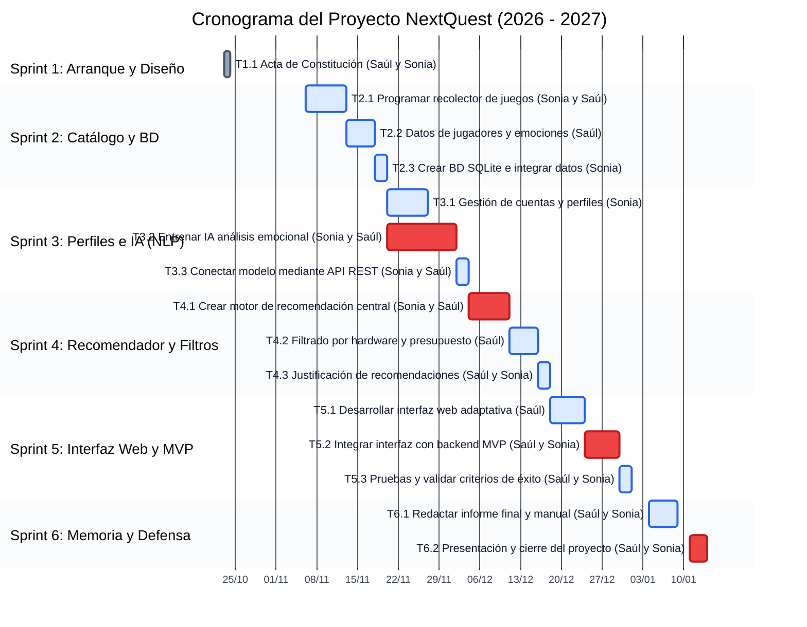

# PruebaSI

```mermaid
%%{init: {
  'theme': 'base',
  'themeVariables': {
    'primaryColor': '#dbeafe',
    'primaryTextColor': '#0f172a',
    'primaryBorderColor': '#2563eb',
    'lineColor': '#64748b',
    'secondaryColor': '#f1f5f9',
    'tertiaryColor': '#ffffff',
    'critBkgColor': '#ef4444',
    'critBorderColor': '#b91c1c',
    'doneTaskBkgColor': '#94a3b8',
    'doneTaskBorderColor': '#475569',
    'taskTextDarkColor': '#0f172a',
    'taskTextColor': '#0f172a',
    'taskTextOutsideColor': '#0f172a',
    'sectionBkgColor': '#f8fafc',
    'altSectionBkgColor': '#e2e8f0',
    'gridColor': '#cbd5e1',
    'fontSize': '14px'
  },
  'gantt': {
    'leftPadding': 220,
    'rightPadding': 90,
    'barHeight': 26,
    'barGap': 8,
    'topPadding': 50,
    'sectionFontSize': 14,
    'numberSectionStyles': 2
  }
}}%%
gantt
    title Cronograma del Proyecto NextQuest (2026 - 2027)
    dateFormat  YYYY-MM-DD
    axisFormat  %d/%m
    todayMarker off

    section Sprint 1: Arranque y Diseño
    T1.1 Acta de Constitución (Saúl y Sonia)                   :done, t1_1, 2026-10-23, 1d

    section Sprint 2: Catálogo y BD
    T2.1 Programar recolector de juegos (Sonia y Saúl)         :t2_1, 2026-11-06, 2026-11-13
    T2.2 Datos de jugadores y emociones (Saúl)                 :t2_2, 2026-11-13, 2026-11-18
    T2.3 Crear BD SQLite e integrar datos (Sonia)              :t2_3, 2026-11-18, 2026-11-20

    section Sprint 3: Perfiles e IA (NLP)
    T3.1 Gestión de cuentas y perfiles (Sonia)                 :t3_1, 2026-11-20, 2026-11-27
    T3.2 Entrenar IA análisis emocional (Sonia y Saúl)         :crit, t3_2, 2026-11-20, 2026-12-02
    T3.3 Conectar modelo mediante API REST (Sonia y Saúl)      :t3_3, 2026-12-02, 2026-12-04

    section Sprint 4: Recomendador y Filtros
    T4.1 Crear motor de recomendación central (Sonia y Saúl)   :crit, t4_1, 2026-12-04, 2026-12-11
    T4.2 Filtrado por hardware y presupuesto (Saúl)            :t4_2, 2026-12-11, 2026-12-16
    T4.3 Justificación de recomendaciones (Saúl y Sonia)       :t4_3, 2026-12-16, 2026-12-18

    section Sprint 5: Interfaz Web y MVP
    T5.1 Desarrollar interfaz web adaptativa (Saúl)            :t5_1, 2026-12-18, 2026-12-24
    T5.2 Integrar interfaz con backend MVP (Saúl y Sonia)      :crit, t5_2, 2026-12-24, 2026-12-30
    T5.3 Pruebas y validar criterios de éxito (Saúl y Sonia)   :t5_3, 2026-12-30, 2027-01-01

    section Sprint 6: Memoria y Defensa
    T6.1 Redactar informe final y manual (Saúl y Sonia)        :t6_1, 2027-01-04, 2027-01-09
    T6.2 Presentación y cierre del proyecto (Saúl y Sonia)     :crit, t6_2, 2027-01-11, 2027-01-14
```
